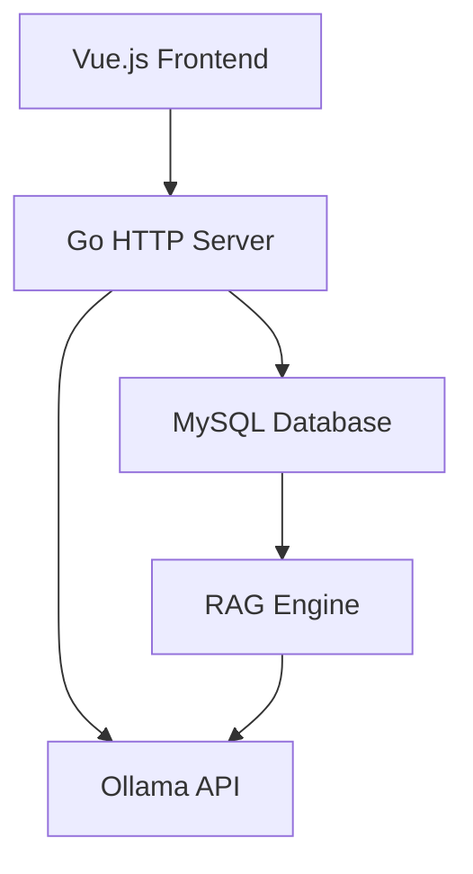

# AI WebUI

Just to Manage Local LLM with webui and easy to chat

## Overview

AI WebUI is a simplified web interface similar to OpenWebUI, designed specifically for connecting to local Ollama models. It provides a streamlined user experience with essential features for chatting with AI models and managing knowledge bases for Retrieval-Augmented Generation (RAG).

## Features

- **Chat Interface**: Clean, responsive chat interface with message history
- **Model Management**: View and select available Ollama models
- **Knowledge Base**: Store and manage documents for RAG functionality
- **RAG Integration**: Enhance model responses with relevant stored knowledge using both keyword and vector search
- **Conversation History**: Save and revisit previous conversations
- **Settings**: Customize preferences and defaults
- **Responsive Design**: Works on desktop and tablet devices

## Technology Stack

### Backend
- **Language**: Go (Golang)
- **Framework**: Built with standard Go libraries
- **Database**: MySQL for storing conversations, settings, and knowledge base
- **AI Service**: Ollama API integration (running locally at http://192.168.1.50:11434)

### Frontend
- **Framework**: Vue.js 3 (Composition API)
- **Styling**: Tailwind CSS
- **State Management**: Pinia
- **Build Tool**: Vite

## Architecture



The application follows a client-server architecture where:
1. The Vue.js frontend communicates with the Go backend via REST APIs
2. The Go backend handles business logic, database operations, and Ollama API interactions
3. MySQL database stores user data, conversations, and knowledge base documents
4. The RAG engine enhances model responses with relevant knowledge base information

## Project Structure

```
aiwebui/
├── cmd/
│   └── server/
│       └── main.go              # Application entry point
├── internal/
│   ├── api/                     # HTTP handlers
│   ├── config/                  # Configuration management
│   ├── database/                # Database connection and models
│   ├── ollama/                  # Ollama API client
│   ├── rag/                     # Retrieval-Augmented Generation engine
│   └── utils/                   # Utility functions
├── web/
│   ├── static/                  # Static assets (CSS, JS, images)
│   ├── templates/               # HTML templates
│   └── vue/                     # Vue.js components
├── docs/                        # Documentation
├── configs/                     # Configuration files
├── migrations/                  # Database migration files
├── go.mod                       # Go module file
├── go.sum                       # Go checksum file
└── README.md                    # Project documentation
```

## Database Schema

The application uses MySQL to store:

- User accounts and settings
- Conversation histories
- Knowledge base documents and embeddings
- Application configuration

Key entities include:
- Users and settings
- Conversations and messages
- Knowledge bases and documents
- Document chunks and embeddings

See [Database Schema](docs/database-schema.md) for detailed table structures.

## API Endpoints

The backend provides RESTful APIs for:

- Chat operations (send message, get history)
- Model management (list, info)
- Knowledge base management (create, upload, search)
- User settings (get, update)

See [API Endpoints](docs/api-endpoints.md) for detailed API documentation.

## RAG Implementation

The Retrieval-Augmented Generation system implements:

- Dual search mechanism (keyword and vector similarity)
- Document chunking and embedding generation
- Result ranking and context injection
- Source attribution in responses

See [RAG Implementation](docs/rag-implementation.md) for technical details.

## Getting Started

### Prerequisites

1. Go 1.21 or higher
2. MySQL 8.0 or higher
3. Ollama service running at http://192.168.1.50:11434

### Database Setup

1. Create MySQL database:
   ```sql
   CREATE DATABASE ai_kpst;
   ```

2. Create user with permissions:
   ```sql
   CREATE USER 'ai_kpst'@'localhost' IDENTIFIED BY 'c61762a01f19d8';
   GRANT ALL PRIVILEGES ON ai_kpst.* TO 'ai_kpst'@'localhost';
   ```

3. Run database migrations:
   ```sql
   -- See docs/mysql-setup.md for full migration script
   ```

### Configuration

Create `configs/config.yaml`:

```yaml
server:
  port: 8080
  host: "localhost"

mysql:
  host: "localhost"
  port: 3306
  username: "ai_kpst"
  password: "c61762a01f19d8"
  database: "ai_kpst"
  charset: "utf8mb4"

ollama:
  base_url: "http://192.168.1.50:11434"
  default_model: "llama3"

rag:
  chunk_size: 1000
  chunk_overlap: 200
  max_results: 5
```

### Building and Running

1. Install Go dependencies:
   ```bash
   go mod tidy
   ```

2. Build the application:
   ```bash
   go build -o aiwebui cmd/server/main.go
   ```

3. Run the application:
   ```bash
   ./aiwebui
   ```

### Frontend Development

1. Navigate to the web directory:
   ```bash
   cd web/vue
   ```

2. Install Node.js dependencies:
   ```bash
   npm install
   ```

3. Start development server:
   ```bash
   npm run dev
   ```

## Deployment

### Production Build

1. Build Vue.js frontend:
   ```bash
   cd web/vue
   npm run build
   ```

2. Build Go backend:
   ```bash
   go build -o aiwebui cmd/server/main.go
   ```

3. Run the production server:
   ```bash
   ./aiwebui
   ```

## Documentation

- [Project Structure](docs/project-structure.md)
- [Database Schema](docs/database-schema.md)
- [MySQL Setup](docs/mysql-setup.md)
- [Go Project Structure](docs/go-project-structure.md)
- [Ollama API Client](docs/ollama-api-client.md)
- [API Endpoints](docs/api-endpoints.md)
- [UI Design](docs/ui-design.md)
- [Frontend JavaScript](docs/frontend-javascript.md)
- [RAG Implementation](docs/rag-implementation.md)

## Contributing

1. Fork the repository
2. Create a feature branch
3. Commit your changes
4. Push to the branch
5. Create a Pull Request

## License

This project is licensed under the GNU General Public License v3.0 - see the [LICENSE](LICENSE) file for details.

## Acknowledgments

- [Ollama](https://ollama.ai/) for the local AI model service
- [Vue.js](https://vuejs.org/) for the frontend framework
- [Tailwind CSS](https://tailwindcss.com/) for styling
- [Go](https://golang.org/) for the backend language
