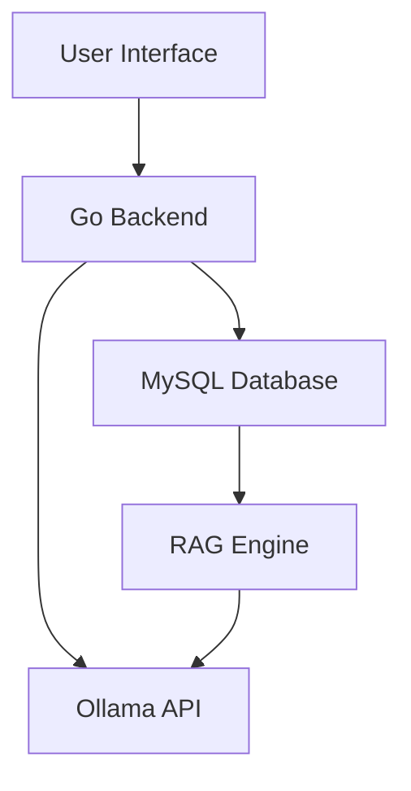
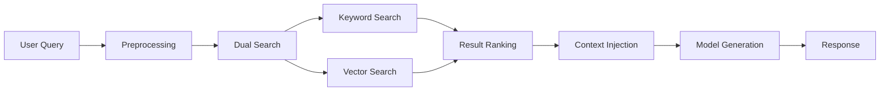

# AI WebUI Architecture Summary

## Project Overview

AI WebUI is a simplified web interface for interacting with local Ollama models, featuring conversation history management and Retrieval-Augmented Generation (RAG) capabilities using MySQL for data storage.

## Key Features Implemented

### 1. Core Architecture
- **Backend**: Go (Golang) with standard library
- **Frontend**: Vue.js 3 with Composition API
- **Database**: MySQL for structured data storage
- **AI Service**: Ollama API integration
- **Deployment**: Self-contained application

### 2. Database Design
Comprehensive schema including:
- User management and settings
- Conversation history with messages
- Knowledge base with documents and embeddings
- Document chunking for efficient retrieval
- Full-text search capabilities

### 3. API Implementation
RESTful endpoints for:
- Chat operations (send/receive messages)
- Conversation management (create/list/delete)
- Model management (list/info)
- Knowledge base operations (create/upload/search)
- User settings (get/update)

### 4. Frontend Implementation
Modern Vue.js interface with:
- Responsive design for desktop/tablet
- Dark/light theme support
- Component-based architecture
- State management with Pinia
- Real-time messaging UI

### 5. RAG Functionality
Dual-search mechanism:
- Keyword-based search using MySQL full-text indexes
- Vector similarity search with Ollama embeddings
- Result ranking and context injection
- Source attribution in responses

## Technical Implementation Details

### Backend Structure
```
cmd/
└── server/
    └── main.go              # Application entry point

internal/
├── api/                     # HTTP handlers
├── config/                  # Configuration management
├── database/                # Database connection and models
├── ollama/                  # Ollama API client
├── rag/                     # Retrieval-Augmented Generation engine
└── utils/                   # Utility functions
```

### Frontend Structure
```
web/
├── vue/
│   ├── components/          # Vue components
│   ├── composables/         # Reusable logic
│   ├── stores/              # Pinia stores
│   ├── utils/               # Utility functions
│   ├── App.vue              # Root component
│   └── main.js              # Entry point
├── static/                  # Static assets
└── templates/               # HTML templates
```

### Data Flow



1. User interacts with Vue.js frontend
2. Frontend communicates with Go backend via REST API
3. Backend processes requests and interacts with:
   - MySQL database for data persistence
   - Ollama API for model interactions
   - RAG engine for enhanced responses
4. Responses are sent back to frontend for display

### RAG Workflow



## Deployment Architecture

### Production Setup
- Single binary Go application
- MySQL database server
- Ollama service
- Reverse proxy (Nginx) for serving frontend

### Configuration
Environment-specific configuration via YAML files:
```yaml
server:
  port: 8080
  host: "localhost"

mysql:
  host: "localhost"
  port: 3306
  username: "ai_kpst"
  password: "c61762a01f19d8"
  database: "ai_kpst"

ollama:
  base_url: "http://192.168.1.50:11434"
  default_model: "llama3"
```

## Security Considerations

- Database credentials secured in configuration
- Input validation and sanitization
- Secure HTTP headers
- Potential for future authentication implementation
- SQL injection prevention through prepared statements

## Performance Optimizations

- Database indexing for fast queries
- Connection pooling for database access
- Caching of frequently accessed data
- Efficient document chunking for retrieval
- Lazy loading of UI components

## Future Enhancement Opportunities

### Feature Expansions
- User authentication and multi-user support
- Advanced document processing (PDF, DOCX, etc.)
- Model fine-tuning capabilities
- Analytics dashboard
- Mobile application

### Technical Improvements
- WebSocket support for real-time streaming
- Integration with specialized vector databases
- Advanced caching mechanisms
- Microservice architecture for scalability
- CI/CD pipeline implementation

## Testing Strategy

### Unit Testing
- Go backend components
- Vue.js component functionality
- Database query logic
- API endpoint validation

### Integration Testing
- End-to-end API workflows
- Database integration
- Ollama API interactions
- RAG functionality verification

### Performance Testing
- Load testing for concurrent users
- Response time measurements
- Database query optimization
- Memory usage profiling

## Monitoring and Maintenance

### Logging
- Structured logging for backend
- Frontend error reporting
- Database query logging
- Audit trails for user actions

### Health Checks
- API endpoint availability
- Database connectivity
- Ollama service status
- Disk space and resource usage

## Conclusion

The AI WebUI provides a complete solution for local AI model interaction with knowledge management capabilities. The modular architecture allows for easy maintenance and future enhancements while the RAG implementation ensures intelligent, context-aware responses based on stored knowledge.

The separation of concerns between frontend and backend, combined with a well-designed database schema and efficient API design, creates a robust foundation for the application. The use of modern technologies like Vue.js and Go ensures good performance and maintainability.