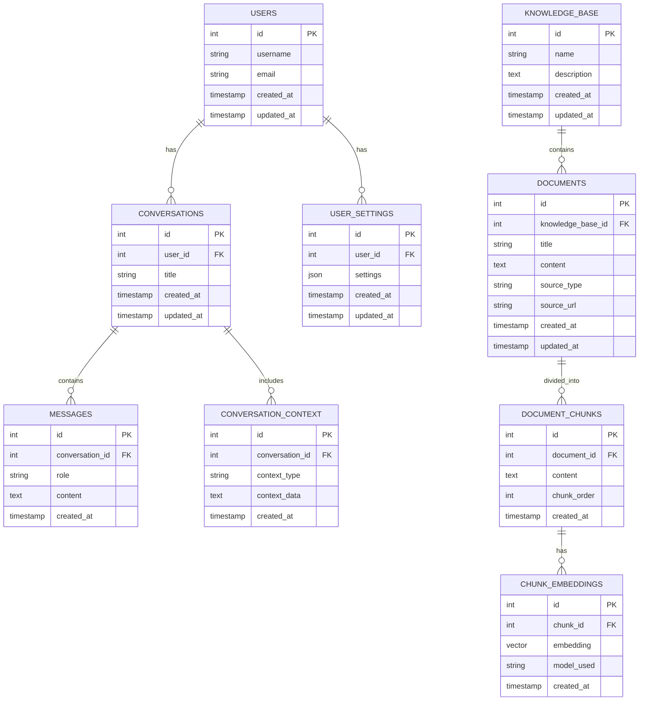

# Database Schema Design

## Overview
This document outlines the database schema for storing conversations, user settings, and knowledge base documents for the AI WebUI application.

## Entity Relationship Diagram



## Table Definitions

### 1. users
Stores user account information.

```sql
CREATE TABLE users (
    id INT AUTO_INCREMENT PRIMARY KEY,
    username VARCHAR(255) UNIQUE NOT NULL,
    email VARCHAR(255) UNIQUE,
    created_at TIMESTAMP DEFAULT CURRENT_TIMESTAMP,
    updated_at TIMESTAMP DEFAULT CURRENT_TIMESTAMP ON UPDATE CURRENT_TIMESTAMP
);
```

### 2. user_settings
Stores user-specific settings and preferences.

```sql
CREATE TABLE user_settings (
    id INT AUTO_INCREMENT PRIMARY KEY,
    user_id INT NOT NULL,
    settings JSON,
    created_at TIMESTAMP DEFAULT CURRENT_TIMESTAMP,
    updated_at TIMESTAMP DEFAULT CURRENT_TIMESTAMP ON UPDATE CURRENT_TIMESTAMP,
    FOREIGN KEY (user_id) REFERENCES users(id) ON DELETE CASCADE
);
```

### 3. conversations
Stores conversation sessions.

```sql
CREATE TABLE conversations (
    id INT AUTO_INCREMENT PRIMARY KEY,
    user_id INT NOT NULL,
    title VARCHAR(255),
    created_at TIMESTAMP DEFAULT CURRENT_TIMESTAMP,
    updated_at TIMESTAMP DEFAULT CURRENT_TIMESTAMP ON UPDATE CURRENT_TIMESTAMP,
    FOREIGN KEY (user_id) REFERENCES users(id) ON DELETE CASCADE
);
```

### 4. messages
Stores individual messages within conversations.

```sql
CREATE TABLE messages (
    id INT AUTO_INCREMENT PRIMARY KEY,
    conversation_id INT NOT NULL,
    role ENUM('user', 'assistant', 'system') NOT NULL,
    content TEXT NOT NULL,
    created_at TIMESTAMP DEFAULT CURRENT_TIMESTAMP,
    FOREIGN KEY (conversation_id) REFERENCES conversations(id) ON DELETE CASCADE
);
```

### 5. knowledge_bases
Stores knowledge base collections.

```sql
CREATE TABLE knowledge_bases (
    id INT AUTO_INCREMENT PRIMARY KEY,
    name VARCHAR(255) NOT NULL,
    description TEXT,
    created_at TIMESTAMP DEFAULT CURRENT_TIMESTAMP,
    updated_at TIMESTAMP DEFAULT CURRENT_TIMESTAMP ON UPDATE CURRENT_TIMESTAMP
);
```

### 6. documents
Stores source documents for the knowledge base.

```sql
CREATE TABLE documents (
    id INT AUTO_INCREMENT PRIMARY KEY,
    knowledge_base_id INT NOT NULL,
    title VARCHAR(255) NOT NULL,
    content LONGTEXT,
    source_type VARCHAR(50),
    source_url TEXT,
    created_at TIMESTAMP DEFAULT CURRENT_TIMESTAMP,
    updated_at TIMESTAMP DEFAULT CURRENT_TIMESTAMP ON UPDATE CURRENT_TIMESTAMP,
    FOREIGN KEY (knowledge_base_id) REFERENCES knowledge_bases(id) ON DELETE CASCADE
);
```

### 7. document_chunks
Stores chunks of documents for efficient retrieval.

```sql
CREATE TABLE document_chunks (
    id INT AUTO_INCREMENT PRIMARY KEY,
    document_id INT NOT NULL,
    content TEXT NOT NULL,
    chunk_order INT NOT NULL,
    created_at TIMESTAMP DEFAULT CURRENT_TIMESTAMP,
    FOREIGN KEY (document_id) REFERENCES documents(id) ON DELETE CASCADE
);
```

### 8. chunk_embeddings
Stores vector embeddings for document chunks.

```sql
CREATE TABLE chunk_embeddings (
    id INT AUTO_INCREMENT PRIMARY KEY,
    chunk_id INT NOT NULL,
    embedding BLOB, -- Vector representation
    model_used VARCHAR(255),
    created_at TIMESTAMP DEFAULT CURRENT_TIMESTAMP,
    FOREIGN KEY (chunk_id) REFERENCES document_chunks(id) ON DELETE CASCADE
);
```

### 9. conversation_context
Stores additional context for conversations.

```sql
CREATE TABLE conversation_context (
    id INT AUTO_INCREMENT PRIMARY KEY,
    conversation_id INT NOT NULL,
    context_type VARCHAR(100) NOT NULL,
    context_data TEXT,
    created_at TIMESTAMP DEFAULT CURRENT_TIMESTAMP,
    FOREIGN KEY (conversation_id) REFERENCES conversations(id) ON DELETE CASCADE
);
```

## Indexes

To improve query performance, the following indexes should be created:

```sql
-- Indexes for conversations
CREATE INDEX idx_conversations_user_id ON conversations(user_id);

-- Indexes for messages
CREATE INDEX idx_messages_conversation_id ON messages(conversation_id);
CREATE INDEX idx_messages_created_at ON messages(created_at);

-- Indexes for documents
CREATE INDEX idx_documents_knowledge_base_id ON documents(knowledge_base_id);

-- Indexes for document_chunks
CREATE INDEX idx_document_chunks_document_id ON document_chunks(document_id);

-- Full-text search indexes
CREATE FULLTEXT INDEX idx_documents_content ON documents(content);
CREATE FULLTEXT INDEX idx_document_chunks_content ON document_chunks(content);
```

## Notes on Implementation

1. **Vector Storage**: The `embedding` column in `chunk_embeddings` table will store vector representations. Depending on your MySQL version, you might need to use BLOB type or a specialized vector type if supported.

2. **JSON Support**: The `settings` column in `user_settings` uses JSON type for flexible storage of user preferences.

3. **Full-Text Search**: Full-text indexes on content columns will enable efficient keyword-based search functionality.

4. **Cascade Deletion**: Foreign key constraints with cascade deletion ensure data integrity when parent records are removed.

5. **Timestamps**: All tables include `created_at` and `updated_at` timestamps for audit trails.