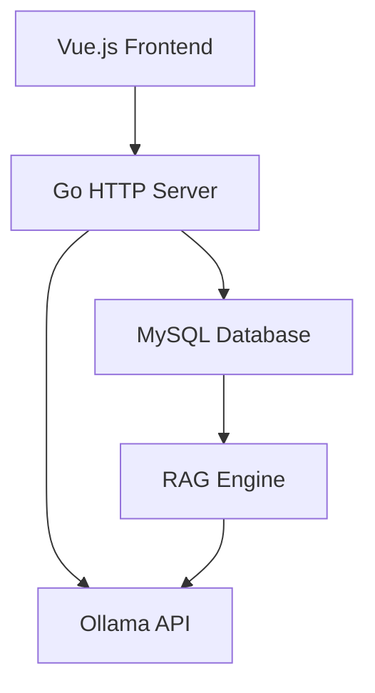

# Project Structure and Architecture

## Overview
This document outlines the architecture and structure for the AI WebUI project that connects to a local Ollama model with MySQL storage for RAG functionality.

## High-Level Architecture



## Project Structure

```
aiwebui/
├── cmd/
│   └── server/
│       └── main.go              # Application entry point
├── internal/
│   ├── api/                     # HTTP handlers
│   ├── config/                  # Configuration management
│   ├── database/                # Database connection and models
│   ├── ollama/                  # Ollama API client
│   ├── rag/                     # Retrieval-Augmented Generation engine
│   └── utils/                   # Utility functions
├── web/
│   ├── static/                  # Static assets (CSS, JS, images)
│   ├── templates/               # HTML templates
│   └── vue/                     # Vue.js components
├── docs/                        # Documentation
├── configs/                     # Configuration files
├── migrations/                  # Database migration files
├── go.mod                       # Go module file
├── go.sum                       # Go checksum file
└── README.md                    # Project documentation
```

## Component Descriptions

### 1. Go HTTP Server (Backend)
- Built with Go standard library or Gin framework
- Provides RESTful API endpoints for:
  - Chat interactions with Ollama
  - Knowledge base management
  - User settings and preferences
  - Model management
- Connects to MySQL database for persistence
- Communicates with Ollama API at http://192.168.1.50:11434

### 2. Vue.js Frontend
- Modern reactive UI with Vue 3
- Components for:
  - Chat interface
  - Settings panel
  - Model selection
  - Knowledge base management
  - User authentication (if needed)
- Communicates with Go backend via AJAX requests

### 3. MySQL Database
- Stores:
  - Conversation histories
  - User settings
  - Knowledge base documents
  - Vector embeddings for RAG
- Tables designed for efficient querying and retrieval

### 4. RAG Engine
- Implements both keyword-based and vector similarity search
- Integrates with Ollama for embedding generation
- Enhances model responses with relevant stored knowledge

## Technology Stack

- Backend: Go (Golang)
- Frontend: Vue.js 3
- Database: MySQL
- AI Model Service: Ollama
- Communication: RESTful APIs