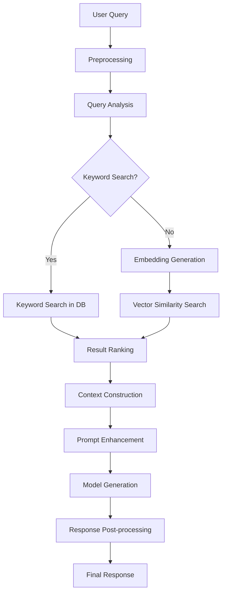
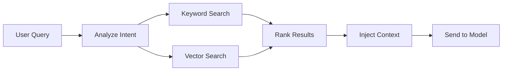

# RAG (Retrieval-Augmented Generation) Implementation

## Overview
This document describes the implementation of Retrieval-Augmented Generation functionality for the AI WebUI application. The RAG system will enhance model responses by retrieving relevant information from the knowledge base.

## RAG Workflow



## Core Components

### 1. Query Preprocessor
Processes and normalizes user queries before searching:
- Remove stop words
- Normalize text (lowercase, punctuation)
- Extract keywords
- Identify query intent

### 2. Dual Search Mechanism
Implements both keyword-based and vector similarity search:

#### Keyword Search
- Uses MySQL full-text search capabilities
- Fast for exact and partial phrase matching
- Good for known terminology searches

#### Vector Search
- Generates embeddings for queries using Ollama
- Compares with stored document embeddings
- Better for semantic similarity

### 3. Result Ranker
Combines and ranks results from both search methods:
- Weighted scoring system
- Recency boosting
- Relevance scoring adjustments

### 4. Context Injector
Formats retrieved information into prompts:
- Selects most relevant document chunks
- Formats context according to model requirements
- Maintains conversation context

## Implementation Details

### Document Chunking Strategy

Documents are split into manageable chunks for efficient retrieval:

```go
type DocumentChunker struct {
    chunkSize    int // Default: 1000 characters
    chunkOverlap int // Default: 200 characters
}

func (dc *DocumentChunker) ChunkDocument(content string) []string {
    // Implementation for splitting documents into overlapping chunks
}
```

### Embedding Generation

Using Ollama's embedding API to generate vector representations:

```go
type EmbeddingGenerator struct {
    ollamaClient *OllamaClient
    model        string // Default: "llama3"
}

func (eg *EmbeddingGenerator) GenerateEmbedding(text string) ([]float64, error) {
    // Call Ollama API to generate embedding
}
```

### Similarity Calculation

Implementing cosine similarity for vector comparison:

```go
func CosineSimilarity(a, b []float64) float64 {
    // Calculate cosine similarity between two vectors
}
```

### Search Algorithms

#### Keyword Search Implementation
```go
func (s *Searcher) KeywordSearch(query string, limit int) ([]SearchResult, error) {
    // Use MySQL full-text search
    // SELECT * FROM document_chunks WHERE MATCH(content) AGAINST(? IN NATURAL LANGUAGE MODE)
}
```

#### Vector Search Implementation
```go
func (s *Searcher) VectorSearch(query string, limit int) ([]SearchResult, error) {
    // 1. Generate embedding for query
    queryEmbedding, err := s.embeddingGenerator.GenerateEmbedding(query)
    if err != nil {
        return nil, err
    }
    
    // 2. Retrieve all document embeddings (or use approximate nearest neighbors)
    // 3. Calculate similarities
    // 4. Return top results
}
```

## Data Flow Process

### 1. Document Ingestion Pipeline
When a document is added to a knowledge base:

1. Document is parsed and cleaned
2. Split into chunks with overlap
3. Each chunk is embedded using Ollama
4. Chunks and embeddings are stored in database


### 2. Query Processing Pipeline
When a user sends a message:

1. Query is analyzed for intent
2. Both keyword and vector searches are performed
3. Results are ranked and filtered
4. Context is injected into the prompt
5. Enhanced prompt is sent to the model



## Database Integration

### Chunk Embeddings Table Structure
```sql
CREATE TABLE chunk_embeddings (
    id INT AUTO_INCREMENT PRIMARY KEY,
    chunk_id INT NOT NULL,
    embedding BLOB, -- Store as binary for efficiency
    model_used VARCHAR(255),
    created_at TIMESTAMP DEFAULT CURRENT_TIMESTAMP,
    FOREIGN KEY (chunk_id) REFERENCES document_chunks(id) ON DELETE CASCADE
);

-- Index for faster retrieval
CREATE INDEX idx_chunk_embeddings_model ON chunk_embeddings(model_used);
```

### Retrieval Optimization
- Pre-compute and cache frequently accessed embeddings
- Use approximate nearest neighbor algorithms for large datasets
- Implement result caching for repeated queries

## Configuration Options

The RAG system will be configurable through the application configuration:

```yaml
rag:
  chunk_size: 1000
  chunk_overlap: 200
  max_results: 5
  keyword_weight: 0.6
  semantic_weight: 0.4
  min_relevance_score: 0.3
  embedding_model: "llama3"
  enable_rag: true
```

## API Integration

### RAG-Enhanced Chat Endpoint
```
POST /api/v1/chat/rag
```

**Request Body:**
```json
{
  "model": "llama3",
  "message": "Explain quantum computing",
  "conversation_id": 123,
  "knowledge_base_ids": [1, 2],
  "enable_rag": true
}
```

**Response:**
```json
{
  "id": 12345,
  "conversation_id": 123,
  "role": "assistant",
  "content": "Based on the information I have about quantum computing...",
  "sources": [
    {
      "document_id": 456,
      "document_title": "Introduction to Quantum Mechanics",
      "relevance_score": 0.92
    }
  ],
  "timestamp": "2026-03-06T12:34:56Z"
}
```

### Knowledge Base Statistics Endpoint
```
GET /api/v1/knowledge-bases/{id}/stats
```

**Response:**
```json
{
  "document_count": 42,
  "chunk_count": 1250,
  "total_characters": 2500000,
  "indexed_for_search": true,
  "embedding_status": {
    "processed_chunks": 1250,
    "failed_chunks": 0,
    "model": "llama3"
  }
}
```

## Frontend Integration

### RAG Toggle Component
```vue
<template>
  <div class="flex items-center justify-between p-4 bg-gray-100 dark:bg-gray-800 rounded-lg">
    <span class="text-sm font-medium">Enable RAG</span>
    <Switch
      v-model="enabled"
      :class="enabled ? 'bg-indigo-600' : 'bg-gray-200'"
      class="relative inline-flex h-6 w-11 items-center rounded-full"
    >
      <span
        :class="enabled ? 'translate-x-6' : 'translate-x-1'"
        class="inline-block h-4 w-4 transform rounded-full bg-white transition"
      />
    </Switch>
  </div>
</template>

<script setup>
import { Switch } from '@headlessui/vue'
import { useRagStore } from '../stores/ragStore'

const ragStore = useRagStore()
const enabled = computed({
  get: () => ragStore.enabled,
  set: (value) => ragStore.setEnabled(value)
})
</script>
```

### Source Attribution Component
```vue
<template>
  <div v-if="sources.length > 0" class="mt-4 pt-4 border-t border-gray-200 dark:border-gray-700">
    <h4 class="text-xs font-semibold text-gray-500 dark:text-gray-400 uppercase mb-2">Sources</h4>
    <div class="space-y-2">
      <div 
        v-for="source in sources" 
        :key="source.document_id"
        class="flex items-start text-sm"
      >
        <DocumentTextIcon class="h-4 w-4 text-gray-400 mt-0.5 mr-2 flex-shrink-0" />
        <span>{{ source.document_title }}</span>
        <span class="ml-2 text-xs text-gray-500">({{ Math.round(source.relevance_score * 100) }}%)</span>
      </div>
    </div>
  </div>
</template>

<script setup>
import { DocumentTextIcon } from '@heroicons/vue/24/outline'

defineProps({
  sources: {
    type: Array,
    default: () => []
  }
})
</script>
```

## Performance Considerations

### Caching Strategy
- Cache frequently accessed embeddings
- Cache recent search results
- Implement cache expiration policies

### Scalability Approaches
- Use approximate nearest neighbors for large vector sets
- Implement database indexing strategies
- Consider using specialized vector databases for large-scale deployments

### Monitoring and Metrics
- Track RAG effectiveness (user feedback on response quality)
- Monitor query processing times
- Measure cache hit rates

## Error Handling

### Common Error Scenarios
1. **Embedding Generation Failures**
   - Fallback to keyword-only search
   - Log and alert for debugging

2. **Database Connectivity Issues**
   - Graceful degradation to direct model queries
   - Inform user of limited functionality

3. **Large Document Processing**
   - Implement timeouts
   - Progress indicators for users

## Testing Strategy

### Unit Tests
- Embedding generation accuracy
- Search algorithm correctness
- Result ranking logic

### Integration Tests
- End-to-end RAG workflow
- Database interaction testing
- API endpoint validation

### Performance Tests
- Query response times
- Concurrent user handling
- Memory usage profiling

## Security Considerations

### Data Privacy
- Ensure sensitive document content is protected
- Implement access controls for knowledge bases
- Encrypt stored embeddings if needed

### Input Sanitization
- Validate and sanitize all user queries
- Prevent injection attacks in search queries
- Limit document upload types and sizes

This RAG implementation provides a robust foundation for enhancing AI responses with relevant knowledge base information while maintaining performance and security standards.